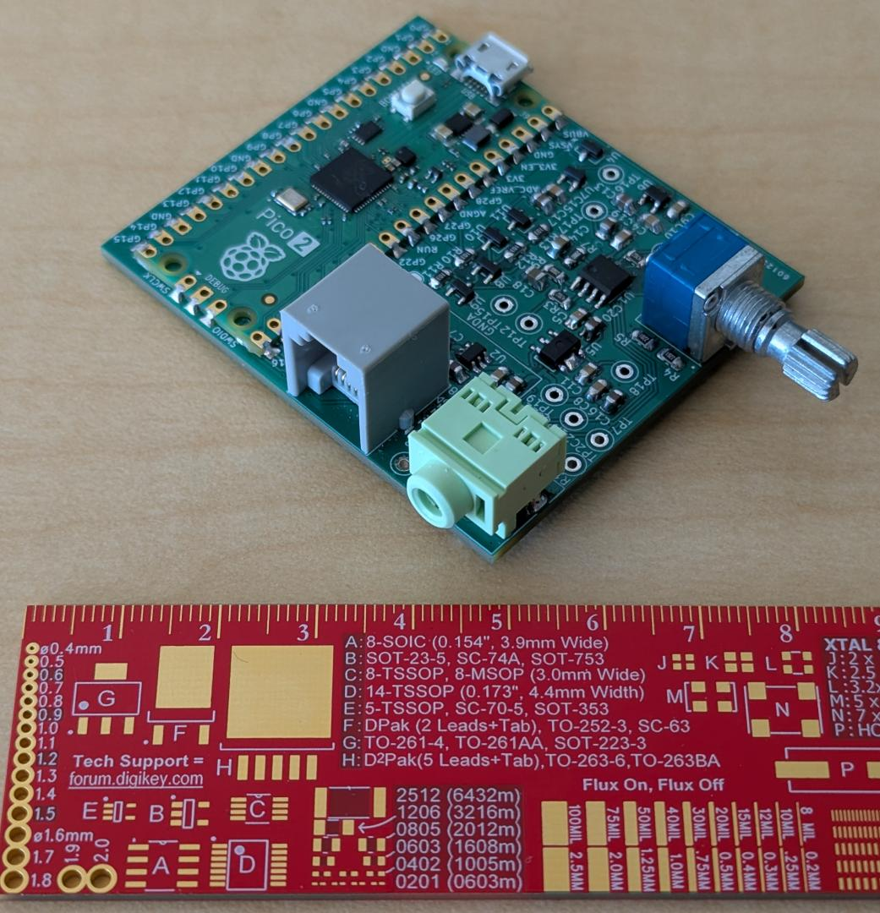

# JetKVM compatible audio ADC
This project takes in mic/line level audio from the 3.5mm jack and digitizes it using a Raspberry Pi Pico 2.

The audio is sent through the serial interface in a modified 48kHz 16-bit 2-channel PCM format. The audio is sent in packets of 32768 samples each, with a `0xFFFF` stop character at the end to ensure left/right channel alignment.

The JetKVM reads its serial interface from `/dev/ttyS3` and sends the raw byte packets though the network to a client PC running a python script (`test_piping.py`) that decodes the packets into a standard PCM audio stream.

## How to deploy:

Since the JetKVM doesn't ship with scp by default, we can use ssh and pipe the binary manually: `cat build/audio-client-c | ssh root@jetKVM "cat > /root/audio-client-c"`

## How to use:

On the client: `ssh root@jetkvm "/root/audio-client-c" | ffplay -fflags nobuffer -f s16le -ch_layout stereo -ar 48k -`.

# Known issues:
If you're going to fab this board design you should know the tip and sleeve contacts on the 3.5mm jack footprint are backwards.

